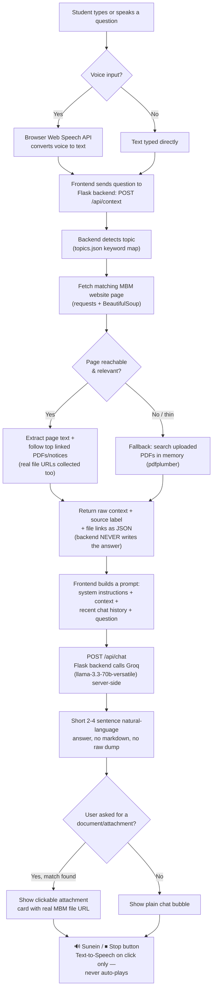

# CampusMitra

**Track 3 — Next-Gen Accessibility & Inclusive Tech**
**Team SynergyX** · CONVERGE: Summer Edition 2026 · MBM University, Jodhpur

A voice/text AI assistant for MBM University students — built accessibility-first
for visually impaired and motor-difficulty students. Ask questions like *"placement
ki latest update kya hai?"* or *"exam datesheet kab aayi?"* by typing or speaking,
and get a short, natural spoken-or-written answer instead of hunting through the
university website or scrolling WhatsApp groups.

**Live demo:** _add your deployed Render/Railway URL here once deployed_
**Demo video:** `Track3_SynergyX_demo` (linked in submission form)

---

## The Problem

MBM's website holds real, useful information (notices, syllabus, placement
stats, exam schedules) but has no accessible, conversational way to reach it.
Results and notices are also often shared only as PDFs in WhatsApp groups.
This is a daily friction point for every student, but it's a much bigger
barrier for visually impaired students (who can't independently browse a
non-screen-reader-friendly site or read a PDF) and motor-difficulty students
(for whom heavy clicking/scrolling is physically taxing).

## The Solution

CampusMitra is a conversational layer on top of MBM's public website. Type
or speak a question — no fixed commands — and get a short, accurate, spoken
answer, with a real downloadable attachment when you ask for a specific
document.

## Team

| Name | Role | Branch |
|---|---|---|
| Kailash | Team Lead | AI & DS, 2nd Year |
| Kanika Jangid | Core Team Member | CSE, 2nd Year |
| Akansha Sharma | Core Team Member | ECE, 2nd Year |
| Latasha Kumawat | Core Team Member | AI & DS, 2nd Year |
| Hitesh Chaudhary | Core Team Member | CSE, 2nd Year |

---

## How It Works — Flowchart



---

## Architecture / Major Components

- **Frontend** (`static/index.html`, `static/style.css`, `static/app.js`) —
  chat UI, mic input, PDF upload, suggestion chips, Library &amp; Profile
  panels, and prompt building. The final AI call is sent to the backend
  (`POST /api/chat`) rather than to any client-side SDK.
- **Backend** (`app.py`, Flask) — topic detection, website scraping
  (`requests` + `BeautifulSoup`), PDF text extraction (`pdfplumber`) and
  fallback search, downloadable-file-link extraction, plus the
  `/api/chat` route which calls **Groq** (`llama-3.3-70b-versatile` via
  the `groq` Python SDK) server-side using a `GROQ_API_KEY` environment
  variable. The API key never reaches the browser.
- **`topics.json`** — editable topic → MBM URL + keyword map. If MBM changes
  a page URL, edit this file only; no code changes needed.

## Features

- Natural voice + text query (no fixed commands)
- Live MBM website knowledge (notices, syllabus, placement, exam, hostel,
  admission, scholarship, calendar)
- Real PDF/document attachments when specifically requested, not just a
  text description
- On-demand audio playback per message (never auto-speaks; only one message
  can speak at a time)
- PDF upload fallback for results/notices that only exist in WhatsApp
- Library panel (browse/upload study material) and a simple local Profile
- Short, conversational, markdown-free answers — 2-4 sentences, since they
  may be read aloud

## Run It Locally

```bash
pip install -r requirements.txt
cp .env.example .env   # then edit .env and add your GROQ_API_KEY
python app.py
```

Open `http://localhost:5000` in Chrome (best Web Speech API support).

Get a free Groq API key at
[console.groq.com/keys](https://console.groq.com/keys).

## Deployment

Deployed on [Render](https://render.com) (free tier):

- **Build command:** `pip install -r requirements.txt`
- **Start command:** `gunicorn app:app`
- A `Procfile` is included for compatibility with Render/Railway/Heroku-style
  platforms.
- In Render's dashboard, go to your service → **Environment** and add
  `GROQ_API_KEY` with your key as the value. Never commit the key to git.
- Render's free tier sleeps after 15 minutes of inactivity — the first
  request after a while takes ~30-60s to wake up.

## Known Limitations & Future Improvements

- No OCR yet — only PDFs with a real text layer are readable (scanned
  handwritten notices are a known gap).
- No live WhatsApp monitoring (Meta API restrictions) — PDFs are uploaded
  manually as a stand-in.
- No login-based personalization — answers come from public website data
  and whatever's been uploaded.
- Future: partner with MBM's website team (itself run by MBM students &amp;
  teachers) to embed CampusMitra as an official widget on mbm.ac.in.

## Files

```
campus_mitra/
├── app.py                 # Flask backend
├── topics.json             # topic -> MBM URL + keyword map
├── requirements.txt
├── Procfile                # for deployment (gunicorn)
├── README.md
└── static/
    ├── index.html
    ├── style.css
    └── app.js
```
